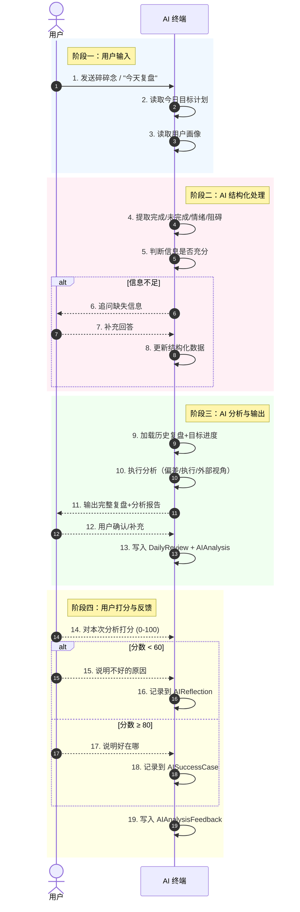
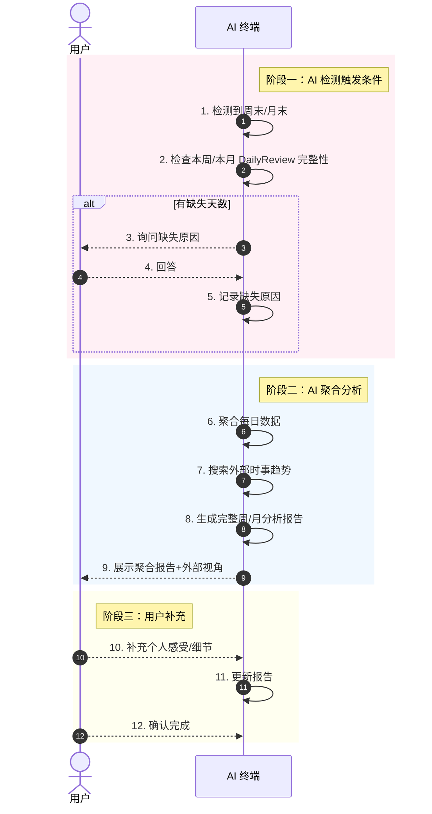

# growth-miniprogram — O.A.I.S PRD

---

## O — Objective（业务目标）

### P.A.M 三段论

- **(P) 现状**：很多人设定目标后缺乏系统化的拆解和追踪机制，导致目标停留在"愿望"层面。日复一日的执行缺少结构化复盘，无法及时发现执行偏差和方向偏离。外部环境和趋势变化时，固化的计划缺乏审视和调整。

- **(A) 动作**：构建一个以 Claude 终端为交互入口的个人目标管理与复盘系统，支持灵活层级的目标拆解（人生终极目标 → 年度 → 月 → 日），通过每日自由碎碎念式的复盘驱动 AI 分析，结合用户画像、历史执行数据和外部时事趋势，持续诊断执行问题、优化计划方向。Phase 1 聚焦 AI 终端交互，Phase 2 扩展 Web 可视化。

- **(M) 指标**：
  - 用户连续使用 ≥ 7 天可形成有效的执行趋势数据
  - AI 周/月分析报告的采纳率 ≥ 60%（用户按建议修改计划的比例）`[待确认]`
  - 系统支持并行目标数 ≥ 3 个
  - 日复盘耗时 ≤ 10 分钟（含 AI 追问时间）

### 不做的事情

- 不做社交/排行榜功能（Phase 2 再说）
- 不做自动执行（AI 只建议不改计划）
- 不做捏造数据（所有分析基于用户实际输入）

---

## A — Architecture（领域模型与业务流）

### A.1 模块与实体总览

| 实体名称 | 核心属性（简述） | 生命周期起点 | 生命周期终点 | 依赖的上游实体 |
|---------|---------------|-----------|-----------|-------------|
| User | 基本信息、画像 | 注册/首次使用 | 用户注销 | 无 |
| LifeGoal | 人生终极/阶段性目标 | 用户设定 | 用户标记完成/放弃 | User |
| YearlyGoal | 年度目标，附可度量单位 | 从 LifeGoal 拆解或独立创建 | 年末/完成/放弃 | LifeGoal (可选) |
| MonthlyPlan | 月度计划，附可度量单位 | 从 YearlyGoal 拆解或独立创建 | 月末/完成/放弃 | YearlyGoal (可选) |
| DailyPlan | 日计划，附可度量单位 | 从 MonthlyPlan 拆解或独立创建 | 日末/完成 | MonthlyPlan (可选) |
| DailyReview | 每日复盘记录 | 用户发起复盘 | 用户确认完成 | DailyPlan |
| WeeklyReview | AI 聚合+用户补充的周复盘 | AI 自动发起 | 用户确认完成 | DailyReview × 7 |
| MonthlyReview | AI 聚合+用户补充的月复盘 | AI 自动发起 | 用户确认完成 | DailyReview + WeeklyReview |
| AIAnalysis | AI 分析报告 | 复盘时生成 | 被下次分析覆盖/归档 | DailyReview + 用户画像 + 时事 |

### A.2 领域实体定义

---

#### 实体：User（用户）

| 属性项 | 定义内容 | 备注说明 |
|--------|---------|---------|
| 实体名称 | 用户 | |
| 实体编码 | User | |
| 唯一标识 | userId | |
| 业务描述 | 使用本系统的个人，拥有目标体系和复盘记录 | |

**核心属性定义**

| 字段名称 | 字段编码 | 数据类型 | 必填 | 业务规则与约束 |
|---------|---------|---------|------|-------------|
| 用户ID | userId | String(UUID) | 是 | 系统自动生成 |
| 昵称 | nickname | String | 否 | |
| 年龄 | age | Int | 是 | |
| 职业 | occupation | String | 是 | |
| 行业 | industry | String | 是 | |
| 城市 | city | String | 否 | |
| 工作日可支配时间 | weekdayAvailableHours | Float | 是 | 小时数 |
| 工作日时间段 | weekdayTimeBlocks | TimeBlock[] | 否 | 如 [{start:"09:00", end:"12:00"}, {start:"14:00", end:"18:00"}] |
| 周末可支配时间 | weekendAvailableHours | Float | 是 | 小时数 |
| 周末时间段 | weekendTimeBlocks | TimeBlock[] | 否 | 如 [{start:"10:00", end:"17:00"}] |
| 目标领域 | goalDomains | String[] | 否 | 如 ["财务", "健康", "学习"] |
| 过往经验 | pastExperience | Text | 否 | 之前做目标管理的经历和困难 |
| 创建时间 | createdAt | DateTime | 是 | |
| 更新时间 | updatedAt | DateTime | 是 | |

**状态机**
User 本身没有复杂的业务状态流转，只存在 `ACTIVE / DISABLED`。

---

#### 实体：LifeGoal（人生目标/总目标）

| 属性项 | 定义内容 | 备注说明 |
|--------|---------|---------|
| 实体名称 | 人生目标/总目标 | |
| 实体编码 | LifeGoal | |
| 唯一标识 | lifeGoalId | |
| 业务描述 | 用户的终极梦想或阶段性大目标，无严格时间限制，或跨度 3-20 年 | |

**核心属性定义**

| 字段名称 | 字段编码 | 数据类型 | 必填 | 业务规则与约束 |
|---------|---------|---------|------|-------------|
| 目标ID | lifeGoalId | String(UUID) | 是 | |
| 用户ID | userId | String(UUID) | 是 | 外键 → User |
| 标题 | title | String | 是 | |
| 描述 | description | Text | 否 | |
| 时间跨度 | timeHorizon | String | 否 | 如 "3年"、"10年"、"一生" |
| 排序 | sortOrder | Int | 否 | 展示顺序 |
| 创建时间 | createdAt | DateTime | 是 | |
| 完成时间 | completedAt | DateTime | 否 | 标记完成时记录 |

**状态字典**

| 状态名称 | 状态枚举值 | 业务含义说明 |
|---------|-----------|-----------|
| 活跃中 | ACTIVE | 正在推进的目标 |
| 已完成 | COMPLETED | 用户标记为达成 |
| 已放弃 | ABANDONED | 用户决定不再追求 |
| 已归档 | ARCHIVED | 长期未更新自动归档 |

**状态转移表**

| 当前状态 | 触发事件 | 前置校验条件 | 目标状态 | 后置动作 |
|---------|---------|------------|---------|---------|
| ACTIVE | 用户标记完成 | 无 | COMPLETED | 记录完成时间 |
| ACTIVE | 用户放弃 | 无 | ABANDONED | AI 可追问原因 |
| COMPLETED | 用户重新激活 | 无 | ACTIVE | |
| ABANDONED | 用户重新激活 | 无 | ACTIVE | |
| ACTIVE | 超过 N 月无关联复盘 | 系统检测 | ARCHIVED | AI 生成归档通知 |

---

#### 实体：YearlyGoal（年度目标）

| 属性项 | 定义内容 | 备注说明 |
|--------|---------|---------|
| 实体名称 | 年度目标 | |
| 实体编码 | YearlyGoal | |
| 唯一标识 | yearlyGoalId | |
| 业务描述 | 按年设定的目标，附可度量单位。可以从 LifeGoal 拆解而来，也可以独立创建 | |

**核心属性定义**

| 字段名称 | 字段编码 | 数据类型 | 必填 | 业务规则与约束 |
|---------|---------|---------|------|-------------|
| 目标ID | yearlyGoalId | String(UUID) | 是 | |
| 关联的人生目标 | lifeGoalId | String(UUID) | 否 | 外键 → LifeGoal |
| 用户ID | userId | String(UUID) | 是 | 外键 → User |
| 标题 | title | String | 是 | |
| 描述 | description | Text | 否 | |
| 年份 | year | Int | 是 | 如 2026 |
| 度量类型 | metricType | Enum | 是 | NUMERIC / DURATION / FREQUENCY / PERCENTAGE / STAGE |
| 目标值 | targetValue | String | 是 | 如 "50000"、"2h"、"4次/周" |
| 当前值 | currentValue | String | 否 | 动态更新 |
| 起始值 | startValue | String | 否 | 年初时的基准值 |
| 创建时间 | createdAt | DateTime | 是 | |

**状态字典与转移表**：与 LifeGoal 相同，增加 `SUSPENDED` 状态用于年中暂停。

---

#### 实体：MonthlyPlan（月计划）

| 属性项 | 定义内容 | 备注说明 |
|--------|---------|---------|
| 实体名称 | 月度计划 | |
| 实体编码 | MonthlyPlan | |
| 唯一标识 | monthlyPlanId | |
| 业务描述 | 按月拆解的计划条目，继承上级目标的度量单位 | |

核心属性与状态同 YearlyGoal。

---

#### 实体：DailyPlan（日计划）

| 属性项 | 定义内容 | 备注说明 |
|--------|---------|---------|
| 实体名称 | 日计划 | |
| 实体编码 | DailyPlan | |
| 唯一标识 | dailyPlanId | |
| 业务描述 | 每日具体的可执行计划，是目标体系的执行层 | |

**状态字典**

| 状态名称 | 状态枚举值 | 业务含义说明 |
|---------|-----------|-----------|
| 待执行 | PENDING | 计划已设定，未到执行时间 |
| 进行中 | IN_PROGRESS | 正在执行 |
| 已完成 | COMPLETED | 按时完成 |
| 部分完成 | PARTIAL | 做了但未全部完成 |
| 未完成 | FAILED | 没做 |
| 已取消 | CANCELLED | 因计划调整取消 |

---

#### 实体：DailyReview（每日复盘）

| 属性项 | 定义内容 | 备注说明 |
|--------|---------|---------|
| 实体名称 | 每日复盘 | |
| 实体编码 | DailyReview | |
| 唯一标识 | dailyReviewId | |
| 业务描述 | 用户每日的自由碎碎念复盘，经 AI 结构化处理后形成 | |

**核心属性定义**

| 字段名称 | 字段编码 | 数据类型 | 必填 | 业务规则与约束 |
|---------|---------|---------|------|-------------|
| 复盘ID | dailyReviewId | String(UUID) | 是 | |
| 用户ID | userId | String(UUID) | 是 | 外键 → User |
| 日期 | date | Date | 是 | YYYY-MM-DD |
| 原始输入 | rawInput | Text | 是 | 用户的碎碎念原文 |
| 完成内容 | completed | Text | 是 | AI 从碎碎念提取 |
| 未完成内容 | notCompleted | Text | 是 | AI 从碎碎念提取 |
| 问题与阻碍 | obstacles | Text | 否 | AI 识别 |
| 情绪状态 | emotionState | String | 否 | AI 识别 |
| 心态备注 | mindsetNote | Text | 否 | AI 分析的用户心态信号 |
| AI 追问记录 | followUpLog | Text[] | 否 | AI 追问的问题和用户回答 |
| AI 分析报告 | aiAnalysisId | String(UUID) | 否 | 外键 → AIAnalysis |
| 创建时间 | createdAt | DateTime | 是 | |

**状态字典**

| 状态名称 | 状态枚举值 | 业务含义说明 |
|---------|-----------|-----------|
| 输入中 | INPUTTING | 用户正在写碎碎念 |
| 分析中 | ANALYZING | AI 正在结构化+追问 |
| 已完成 | COMPLETED | 用户确认 |
| 已跳过 | SKIPPED | 用户跳过这一天 |

**状态转移表**

| 当前状态 | 触发事件 | 前置校验条件 | 目标状态 | 后置动作 |
|---------|---------|------------|---------|---------|
| INPUTTING | 用户发送碎碎念 | 内容非空 | ANALYZING | AI 提取结构化数据 |
| ANALYZING | AI 完成结构化 | AI 识别信息不足 | INPUTTING | AI 发起追问 |
| ANALYZING | AI 完成结构化 | AI 认为信息充分 | COMPLETED | 生成 AI 分析报告 |
| COMPLETED | 用户修改 | 无 | INPUTTING | |

---

#### 实体：WeeklyReview / MonthlyReview

核心属性同 DailyReview，但数据来源于 AI 自动聚合：

- **触发方式**：AI 在周末/月末自动发起
- **数据来源**：读取本周/本月所有 DailyReview
- **补充机制**：AI 聚合后展示概要，用户补充细节
- **缺失天数**：如有缺失，AI 追问原因并记录

---

#### 实体：AIAnalysisFeedback（AI 分析用户反馈）

| 属性项 | 定义内容 | 备注说明 |
|--------|---------|---------|
| 实体名称 | AI 分析用户反馈 | |
| 实体编码 | AIAnalysisFeedback | |
| 唯一标识 | feedbackId | |
| 业务描述 | 用户对 AI 分析报告的打分和反馈，用于 AI 自我优化 | |

**核心属性定义**

| 字段名称 | 字段编码 | 数据类型 | 必填 | 业务规则与约束 |
|---------|---------|---------|------|-------------|
| 反馈ID | feedbackId | String(UUID) | 是 | |
| 关联分析 | aiAnalysisId | String(UUID) | 是 | 外键 → AIAnalysis |
| 用户评分 | userScore | Int | 是 | 0-100 |
| 是否及格 | isPass | Boolean | 是 | score ≥ 60 |
| 是否优秀 | isExcellent | Boolean | 是 | score ≥ 80 |
| 优秀原因 | excellentReason | Text | 当 score ≥ 80 | 用户说明好在哪，AI 记录到 SuccessCase |
| 不及格原因 | failReason | Text | 当 score < 60 | 用户说明差在哪，AI 记录到 AIReflection |
| 创建时间 | createdAt | DateTime | 是 | |

#### 实体：AIReflection（AI 反思记录）

| 属性项 | 定义内容 | 备注说明 |
|--------|---------|---------|
| 实体名称 | AI 反思记录 | |
| 实体编码 | AIReflection | |
| 唯一标识 | reflectionId | |
| 业务描述 | AI 从用户低分反馈中提取的反思，用于优化后续判断 | |

| 字段名称 | 字段编码 | 数据类型 | 必填 | 业务规则与约束 |
|---------|---------|---------|------|-------------|
| 反思ID | reflectionId | String(UUID) | 是 | |
| 来源反馈 | feedbackId | String(UUID) | 是 | 外键 → AIAnalysisFeedback |
| 问题描述 | issueDescription | Text | 是 | AI 归纳总结哪里做得不好 |
| 优化方向 | improvementDirection | Text | 是 | AI 下次要如何改进 |
| 是否已应用 | isApplied | Boolean | 否 | 后续分析中是否已体现改进 |

#### 实体：AISuccessCase（AI 优秀案例）

| 属性项 | 定义内容 | 备注说明 |
|--------|---------|---------|
| 实体名称 | AI 优秀案例 | |
| 实体编码 | AISuccessCase | |
| 唯一标识 | successCaseId | |
| 业务描述 | 用户高分反馈中的优秀分析案例，AI 记录模式供后续参考 | |

| 字段名称 | 字段编码 | 数据类型 | 必填 | 业务规则与约束 |
|---------|---------|---------|------|-------------|
| 案例ID | successCaseId | String(UUID) | 是 | |
| 来源反馈 | feedbackId | String(UUID) | 是 | 外键 → AIAnalysisFeedback |
| 优秀模式 | excellentPattern | Text | 是 | AI 归纳总结这次做对了什么 |
| 复现条件 | replicableCondition | Text | 否 | 什么条件下可以复用这种分析模式 |

---

#### 实体：AIAnalysis（AI 分析报告）

| 属性项 | 定义内容 | 备注说明 |
|--------|---------|---------|
| 实体名称 | AI 分析报告 | |
| 实体编码 | AIAnalysis | |
| 唯一标识 | aiAnalysisId | |
| 业务描述 | AI 基于用户复盘、目标数据、画像和外部信息生成的分析报告 | |

**核心属性定义**

| 字段名称 | 字段编码 | 数据类型 | 必填 | 业务规则与约束 |
|---------|---------|---------|------|-------------|
| 分析ID | aiAnalysisId | String(UUID) | 是 | |
| 关联复盘 | reviewId | String(UUID) | 是 | 外键 → DailyReview/WeeklyReview/MonthlyReview |
| 分析类型 | analysisType | Enum | 是 | DAILY / WEEKLY / MONTHLY |

**分析报告结构**（存储在单个 Text 或结构化 JSON 字段中）：

```
{
  "completionSummary": {         // 完成/未完成总结
    "completed": [],
    "notCompleted": [],
    "completionRate": "百分比"
  },
  "deviationAnalysis": {         // 与目标的偏差分析
    "onTrack": [],
    "behind": [],
    "riskLevel": "低/中/高"
  },
  "executionDiagnosis": {        // 执行问题诊断
    "issues": [],
    "rootCause": "意愿不足/方法不对/外部阻力/目标不合理",
    "pattern": "是否发现重复模式"
  },
  "adjustmentSuggestions": {     // 调整建议
    "planChanges": [],
    "executionOptimization": []
  },
  "externalPerspective": {       // 外部视角（核心差异化）
    "trendInsights": [],
    "directionCheck": "目标方向是否仍然成立",
    "newOpportunities": [],
    "risks": []
  }
}
```

### A.3 核心数据流与交互

**触发源**：用户在 Claude 终端中主动发起交互。

**每日复盘流程**：



**周/月复盘流程**：



### A.4 核心规则与算法

**规则 1：可度量检查**

每个目标/计划必须有度量单位。系统提供以下预设类型，用户也可自定义：

| 度量类型 | 编码 | 输入格式 | 示例 |
|---------|------|---------|------|
| 数值 | NUMERIC | {当前值}/{目标值} {单位} | 存了 10000/50000 元 |
| 时长 | DURATION | {分钟数}min | 学习 120min |
| 频次 | FREQUENCY | {已完成次数}/{目标次数} | 健身 2/4 次 |
| 百分比 | PERCENTAGE | {完成百分比}% | 项目完成 65% |
| 阶段 | STAGE | {当前阶段}→{目标阶段} | 英语 A2→B1 |

**规则 2：AI 分析引擎规范**

AI 分析每次必须包含以下四层：

1. **完成总结层** — 客观事实，不解释
2. **偏差分析层** — 与目标的差距
3. **执行诊断层** — 根因分析，识别模式
4. **外部视角层** — 结合时事趋势审视方向

**规则 3：AI 追问次数限制**

每次复盘 AI 最多追问 2 次，避免用户疲劳。第 3 次仍信息不足时，基于已有信息完成分析并标注 `[部分信息缺失]`。

---

## I — Interface（人机交互层）

### Phase 1: AI 终端（Claude）

本阶段所有交互在 Claude 终端中完成，无 GUI。通过 AI 提示词和输出格式定义交互体验。

**交互方式**：自然语言对话

**核心交互点**：

| 交互 | 触发方式 | AI 行为 | 输出格式 |
|------|---------|--------|---------|
| 设定目标 | 用户说"设定目标" | 引导用户按层级输入，检查度量完整性 | 结构化目标列表 |
| 每日复盘 | 用户说"复盘"或开始自由碎碎念 | 提取结构化数据，追问缺失 | 完整复盘报告 |
| 查看进度 | 用户说"看看进度" | 读取所有目标的当前进度 | 进度概览 |
| 修改计划 | 用户说"我要改计划" | AI 列出目前计划 → 用户修改 → 确认 | 更新确认 |
| 周复盘 | AI 主动发起（周末检测） | 聚合周数据，搜索时事，分析 | 周报 |
| 月复盘 | AI 主动发起（月末检测） | 聚合月数据，全面分析+外部视角 | 月报 |

### Phase 2: Web 看板（当前阶段）

| 页面 | 数据源 | 核心内容 |
|------|--------|---------|
| 总览 | User → LifeGoal → YearlyGoal + AIAnalysis 聚合 | 用户信息(hover)、人生总目标、进行中年度目标、AI 改进建议、当月每个目标完成进度 |
| 目标链 | LifeGoal → YearlyGoal → MonthlyPlan | 三级目标层级树，支持全部/进行中/已完成筛选，已完成置灰 |
| 计划 | 按年/月/周/日维度切换 | 年/月选择器 + 维度切换 + 左栏日历/时间线 + 右栏三面板(计划/评估/报告) |

**主题**：浅色主题（#f5f5f7 背景，白色卡片）
**技术栈**：Vite + React + TypeScript，端口 3002，API 代理到 localhost:3001

---

## S — Scenarios（边界与异常场景）

| 场景编号 | 类型 | 场景描述 | 前置条件 | 预期系统行为 |
|---------|------|---------|---------|------------|
| SCN-S-01 | Security | 越权查看 | 多人协作场景 | Phase 2 处理，Phase 1 单人模式不适用 |
| SCN-E-01 | Error | 用户输入不完整 | 用户只说了"今天还行" | AI 提取信息不足 → 追问最多 2 次 → 标注 `[部分信息缺失]` 完成分析 |
| SCN-E-02 | Error | AI 搜索外部资讯超时 | 周/月分析时网络不通 | 跳过外部视角，标注 `[外部信息获取失败]`，不阻塞分析流程 |
| SCN-C-01 | Concurrency | 同时修改计划 | 用户多终端 | Phase 1 单终端模式不涉及 |
| SCN-U-01 | Undo | 用户想撤销复盘 | 已完成的复盘 | 支持重新打开复盘记录进入 INPUTTING 状态 |
| SCN-R-01 | Restriction | 目标层级冲突 | 目标同时出现在两个层级 | AI 检测到后提示用户确认归属 |
| SCN-E-03 | Edge | 全部目标已完成 | 无活跃目标 | AI 提示祝贺 → 引导设定新目标 |
| SCN-E-04 | Edge | 连续 N 天未复盘 | 超过 3 天无复盘 | 周/月复盘时 AI 问原因，记录到分析报告中 |
| SCN-E-05 | Edge | 目标到期但未完成 | 年度/月度目标到期 | AI 自动触发复盘：询问是否延期/调整/放弃 |

---

## 自检矩阵

| 检查项 | 结果 | 说明 |
|--------|------|------|
| 状态机完整性 | ✅ | LifeGoal/DailyPlan/DailyReview 均有完整状态转移表 |
| 数据流-状态机一致性 | ✅ | 时序图中每一步对应状态转移 |
| 界面-实体绑定 | ✅ | UI 交互点均在 I 层中描述，绑定对应实体 |
| 场景覆盖度 | ✅ | 覆盖 SECURE 六类 |
| O-M 可验证性 | ⚠️ | 采纳率 60% 需上线后验证，标记 `[待确认]` |
| 实体关系一致性 | ✅ | 实体关系拓扑与数据流一致 |
