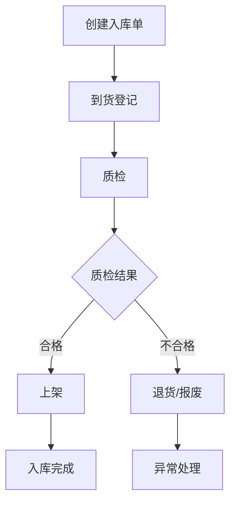

# 入库业务流程

## 业务概述

入库是仓库管理的核心业务之一，包括采购入库、退货入库、调拨入库等场景。本文档描述标准的采购入库流程。

## 核心流程



### 流程说明

1. **创建入库单**
   - 来源：采购订单、供应商发货通知
   - 生成入库单号（格式：IN{YYYYMMDD}{序号}）
   - 状态：待到货

2. **到货登记**
   - 扫描入库单号或手动输入
   - 记录到货时间、车牌号、司机信息
   - 核对到货数量与入库单数量
   - 状态：待质检

3. **质检**
   - 按商品进行质检
   - 记录合格数量、不合格数量、不合格原因
   - 拍照留存（可选）
   - 状态：质检中 → 待上架 / 异常

4. **上架**
   - 系统推荐上架货位（基于货位容量、商品属性）
   - 扫描货位码确认
   - 记录实际上架数量和货位
   - 增加库存
   - 状态：部分上架 / 上架完成

5. **入库完成**
   - 所有商品上架完成
   - 生成入库报告
   - 通知采购部门
   - 状态：已完成

## 业务规则

### 基础规则

1. **入库单创建**
   - 必须关联采购订单或供应商
   - 入库数量不能超过采购订单剩余数量
   - 同一采购订单可以分批入库

2. **到货登记**
   - 到货数量可以与入库单数量不一致（记录差异）
   - 超量到货需要采购确认后才能继续
   - 短缺到货记录差异，可以继续质检

3. **质检规则**
   - 必须质检的商品：食品、药品、贵重物品
   - 可选质检的商品：普通商品（根据供应商信誉）
   - 质检不合格的商品不能上架

4. **上架规则**
   - 同一商品可以上架到多个货位
   - 货位容量不足时，系统提示更换货位
   - 特殊商品（易燃易爆、冷链）必须上架到指定区域

### 异常处理

| 异常场景 | 处理方式 |
|----------|----------|
| 超量到货 | 采购确认后，创建新入库单或退回超量部分 |
| 短缺到货 | 记录差异，通知采购跟进，剩余数量等待下次到货 |
| 质检不合格 | 隔离存放，联系供应商退货或报废 |
| 货位不足 | 系统推荐其他货位，或触发库存调整 |
| 商品损坏 | 拍照留存，记录损坏数量，联系供应商索赔 |

## 状态流转

```
待到货 → 待质检 → 质检中 → 待上架 → 部分上架 → 上架完成 → 已完成
                    ↓
                  异常（质检不合格、货位不足等）
```

### 状态说明

| 状态 | 说明 | 可执行操作 |
|------|------|------------|
| 待到货 | 入库单已创建，等待货物到达 | 到货登记、取消入库单 |
| 待质检 | 货物已到达，等待质检 | 开始质检 |
| 质检中 | 正在进行质检 | 记录质检结果 |
| 待上架 | 质检完成，等待上架 | 开始上架 |
| 部分上架 | 部分商品已上架，剩余待上架 | 继续上架 |
| 上架完成 | 所有商品已上架，等待确认 | 完成入库 |
| 已完成 | 入库流程结束 | 查看入库报告 |
| 异常 | 流程中断，需要处理异常 | 异常处理、取消入库单 |

## 领域模型

### 核心实体

| 实体 | 说明 | 核心字段 |
|------|------|----------|
| InboundOrder | 入库单 | orderNo, poNo, supplierId, status, totalQty |
| InboundItem | 入库明细 | orderId, skuCode, planQty, actualQty, qcQty |
| QualityCheck | 质检记录 | itemId, qcResult, qualifiedQty, unqualifiedQty, reason |
| PutawayTask | 上架任务 | itemId, locationId, qty, operator, putawayTime |

### 实体关系

```
InboundOrder (1) ----< (N) InboundItem
InboundItem (1) ----< (N) QualityCheck
InboundItem (1) ----< (N) PutawayTask
```

## 权限控制

| 角色 | 权限 |
|------|------|
| 仓库主管 | 创建入库单、取消入库单、查看所有入库单 |
| 收货员 | 到货登记、查看待到货入库单 |
| 质检员 | 质检、查看待质检入库单 |
| 上架员 | 上架、查看待上架入库单 |

## 性能要求

- 入库单创建响应时间 < 500ms
- 到货登记响应时间 < 300ms
- 上架操作响应时间 < 200ms（高频操作）
- 支持并发上架（多个上架员同时操作）

## 相关文档

- [入库 API 文档](../../api/inbound-api.md)
- [库存管理](./inventory-flow.md)
- [货位管理](./location-management.md)
